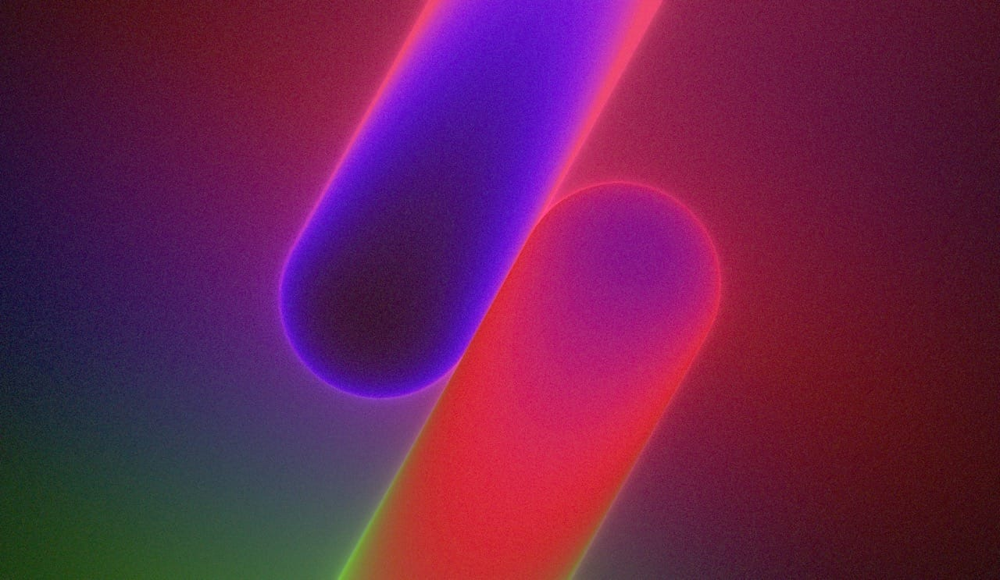
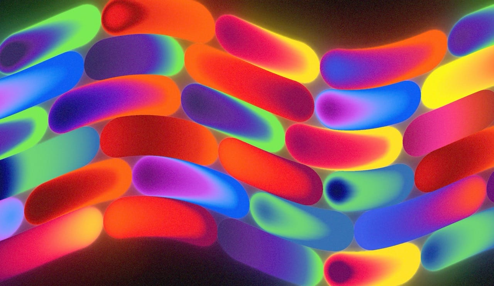
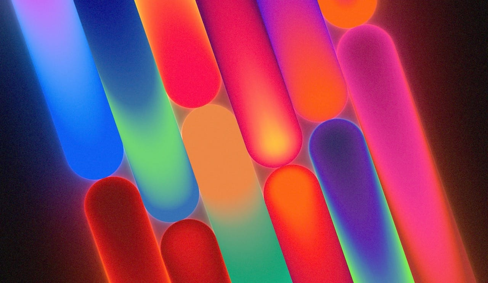

# TSL Gradient Pills

Three.js gradient pills effect using TSL (Three Shading Language) and WebGPU.

Recreating the Blender gradient pills effect by Bad Normals.

[Live Demo](https://felixturner.github.io/tsl-gradient-pills/)

## Features

- 4 scene modes: Duo, Grid (6x2), Tubes (scrolling animation), Mono
- B-spline gradient coloring with normal-based bend
- Selective bloom post-processing (masked to background)
- Glow planes, wave deformation, fade transitions
- GUI controls for all parameters (Press 'q' to toggle controls)

## Tech Stack

- Three.js with TSL (Three Shading Language) + WebGPU
- GSAP, Vite, Vanilla JS

## Requirements

- A browser with WebGPU support (Chrome 113+, Edge 113+, Safari 18+, or Firefox Nightly with flags)

## Getting Started

```bash
# Install dependencies
npm install

# Run dev server
npm run dev

# Build for production
npm run build
```

## How It Works

### Gradient Rendering

The pills use B-spline interpolation for smooth gradient transitions between 4 color stops. The gradient sample position is modulated by the surface normal to bend the gradients at the edges.

### Edge Glow

Pills have emissive edges based on surface normal (brighter where the surface curves away from camera). The emissive is extracted, bloomed, and composited onto the background only - masked by the pill silhouette so the bloom appears behind the pills rather than washing them out.

### Glow Planes

Each pill has an invisible plane behind it that renders a radial gradient using an SDF (signed distance field) matching the pill's capsule shape. This creates a fake volumetric lighting effect - a soft colored glow that appears to emanate from the pill. The glow planes are composited separately and masked to only appear on the background.

### Wave Deformation

Pills can be deformed with a sine wave along their length. The wave direction is aligned with the global rotation so it always appears to travel in the same direction regardless of pill orientation.

## Credits

- Felix Turner | [airtight.cc](https://airtight.cc)
- Effect Design by [Bad Normals](https://badnormals.com/)
- Inspired by [damonxart](https://www.instagram.com/damonxart/)

## License

MIT

## Screenshots




